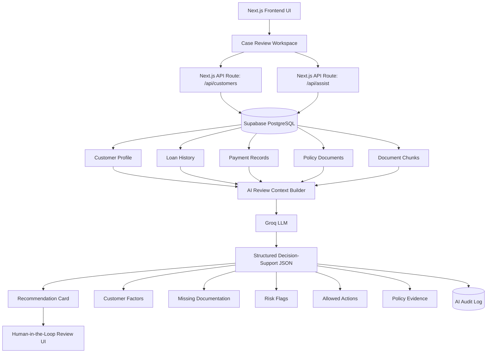
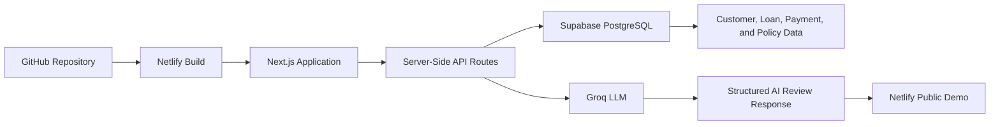
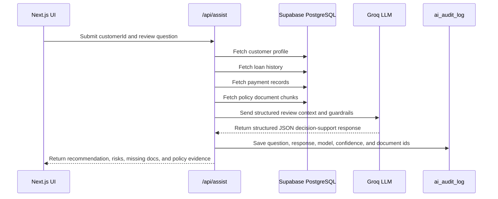
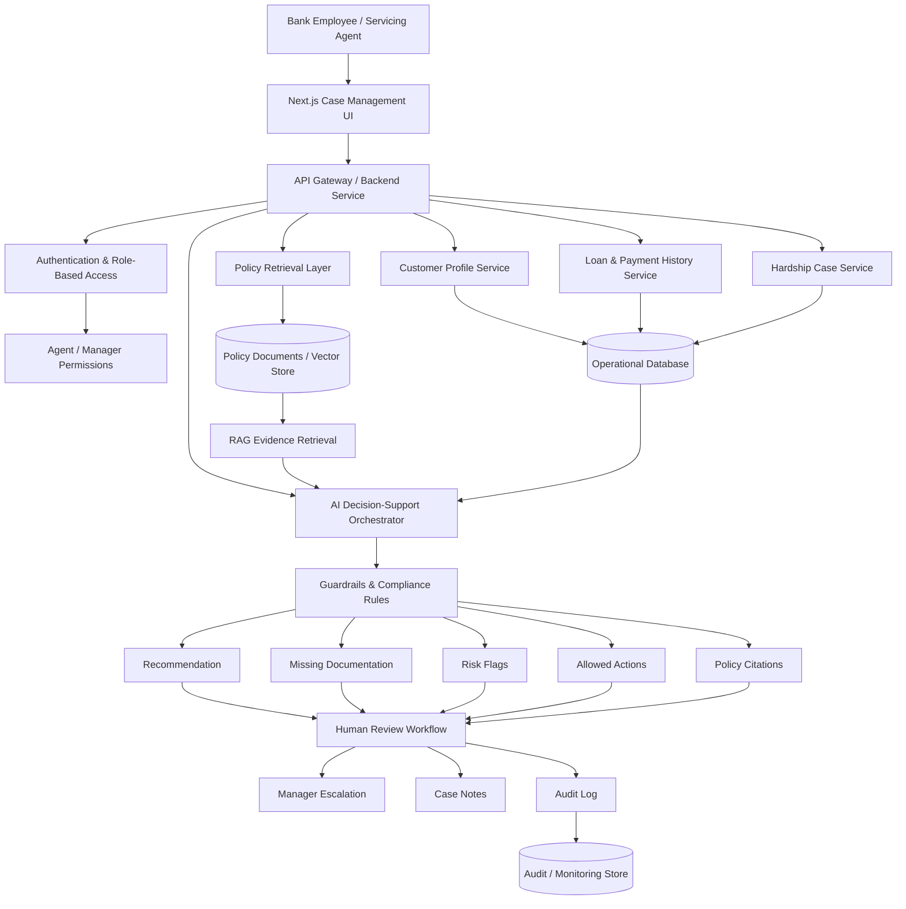

# AssistIQ Banking Copilot

**AssistIQ Banking Copilot** is an AI-powered customer assistance review workspace built to demonstrate AI architecture, enterprise software engineering, responsible AI design, and human-in-the-loop decision support for regulated banking operations.

**Built by Jamshir Qureshi**

## Live Demo

[View AssistIQ Banking Copilot](https://assistiq-banking-copilot.netlify.app/)

---

## Project Overview

AssistIQ Banking Copilot simulates how a loan servicing or customer assistance team can use AI to review hardship assistance requests. The system is designed to help servicing agents evaluate customer context, loan history, payment records, and policy evidence before routing the case for human review.

The application does **not** approve or deny customers. Instead, it provides structured AI decision support with:

- Customer and loan factors
- Payment history review
- Policy evidence
- Missing documentation
- Risk flags
- Allowed next actions
- Human-in-the-loop compliance guidance
- Audit logging for traceability

This project is designed as a portfolio demonstration of applied AI architecture, cloud-ready software engineering, and responsible AI patterns in a regulated financial services workflow.

---

## Product Goal

AssistIQ is designed to help banking operations teams answer:

- Is the customer potentially eligible for hardship assistance review?
- What customer, loan, and payment factors should be considered?
- What policy evidence supports the recommendation?
- What documents are missing?
- What risk flags require escalation?
- What safe next actions can the servicing agent take?
- How can AI assist without replacing authorized human decision-making?

---

## Current Deployed Architecture

The deployed demo uses a cloud-ready Next.js architecture connected to Supabase PostgreSQL and Groq LLM inference. This design supports reliable public access while demonstrating a realistic end-to-end AI workflow with database-backed customer context, policy evidence retrieval, structured LLM output, and audit logging.



---

## Deployment Flow



---

## Data Flow



---

## AI Decision-Support Behavior

The AI assistant is intentionally constrained for regulated banking workflows.

It can:

- Summarize customer hardship context
- Review customer, loan, and payment factors
- Identify missing documentation
- Highlight risk flags
- Cite policy evidence
- Recommend safe next actions
- Suggest escalation to a manager when needed

It cannot:

- Approve hardship assistance
- Deny hardship assistance
- Make a final credit decision
- Override policy
- Replace authorized human review

Every response includes a compliance disclaimer that the output is decision support only.

---

## Responsible AI Design

AssistIQ follows responsible AI principles for regulated workflows:

- **Human-in-the-loop:** Final decisions require authorized employee review.
- **Policy evidence:** Recommendations include supporting policy references.
- **Structured output:** LLM responses are constrained to a predictable JSON contract.
- **Audit logging:** AI questions, responses, confidence, model used, and retrieved documents are recorded.
- **Fallback behavior:** If the LLM provider is unavailable, deterministic fallback logic prevents the application from failing.
- **Role-aware design:** The reference architecture supports future role-based permissions and workflow escalation.
- **No autonomous approval:** The system never approves or denies assistance.

---

## Technology Stack

### Deployed Demo Stack

- **Next.js** – frontend and server-side API routes
- **React** – case review user interface
- **TypeScript** – typed application logic
- **Supabase PostgreSQL** – customer, loan, payment, policy, and audit data
- **Groq LLM** – dynamic AI decision-support generation
- **Netlify** – public cloud deployment
- **GitHub** – source control and deployment integration

### Supabase Tables Used

- `customers`
- `loans`
- `payments`
- `policy_documents`
- `document_chunks`
- `ai_audit_log`
- `user_roles`

---

## API Routes

### `/api/customers`

Retrieves customer case data from Supabase, including customer profile and related loan information for the case queue.

### `/api/assist`

Receives a customer ID and review question, then:

1. Fetches the customer profile from Supabase.
2. Fetches loan history.
3. Fetches payment records.
4. Fetches policy document chunks.
5. Builds a regulated AI review prompt.
6. Calls Groq LLM for structured decision-support output.
7. Saves the interaction to `ai_audit_log`.
8. Returns a structured response to the UI.

---

## Environment Variables

The application requires these environment variables for local and Netlify deployment:

```env
NEXT_PUBLIC_SUPABASE_URL=your_supabase_project_url
SUPABASE_SERVICE_ROLE_KEY=your_supabase_service_role_key
GROQ_API_KEY=your_groq_api_key
```

Security notes:

- `SUPABASE_SERVICE_ROLE_KEY` must only be used server-side.
- `GROQ_API_KEY` must only be used server-side.
- Do not commit `.env.local` to GitHub.
- Do not expose service keys in frontend code.

---

## Local Development

Install dependencies:

```bash
npm install
```

Run the development server:

```bash
npm run dev
```

Open:

```text
http://localhost:3000
```

Build locally:

```bash
npm run build
```

---

## Netlify Deployment

The app is deployed through Netlify using GitHub integration.

Recommended Netlify settings:

```text
Build command: npm run build
Publish directory: .next
```

Required Netlify environment variables:

```text
NEXT_PUBLIC_SUPABASE_URL
SUPABASE_SERVICE_ROLE_KEY
GROQ_API_KEY
```

---

## Enterprise Reference Architecture

In a production banking environment, AssistIQ could be extended with a deeper enterprise architecture.



---

## AI Architecture Concepts Demonstrated

This project demonstrates:

- AI-assisted decision support for regulated financial workflows
- Server-side LLM integration
- Supabase-backed application data
- Policy evidence retrieval
- Structured LLM response contracts
- Human-in-the-loop workflow design
- Deterministic fallback behavior
- Audit logging
- Secure environment variable handling
- Frontend/backend integration through Next.js API routes
- Cloud deployment through Netlify
- Responsible AI controls for high-risk decision workflows

---

## Portfolio Positioning

AssistIQ Banking Copilot demonstrates how AI can be integrated into enterprise operations while preserving compliance, traceability, explainability, and human accountability.

The project shows both hands-on implementation and architecture thinking across:

- Product workflow design
- AI orchestration
- Database integration
- API design
- Prompt design and guardrails
- Responsible AI
- Cloud deployment
- Software engineering delivery

**Built by Jamshir Qureshi**
