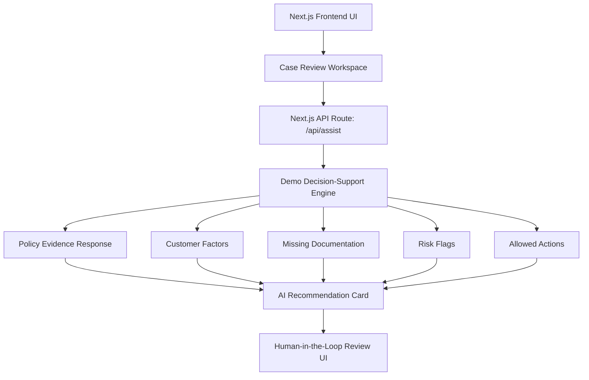
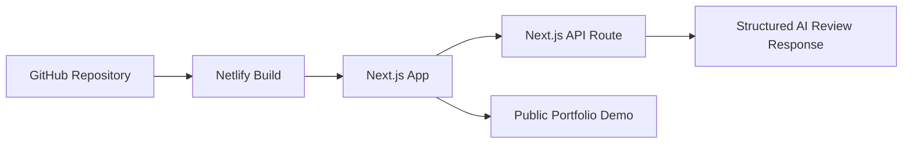
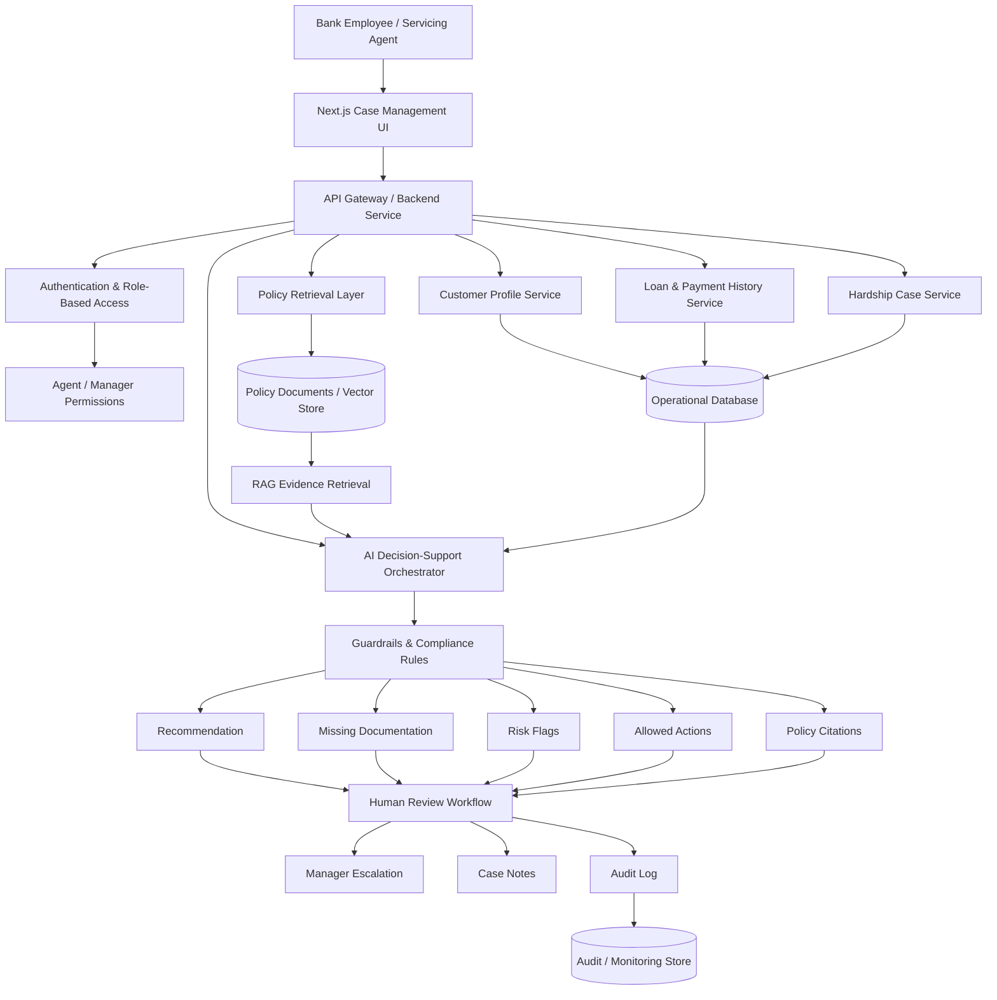

# AssistIQ Banking Copilot

**Live Demo:** [https://assistiq-banking-copilot.netlify.app/](https://assistiq-banking-copilot.netlify.app/)

**AssistIQ Banking Copilot** is an AI-powered customer assistance review workspace built to demonstrate AI architecture, enterprise software engineering, responsible AI design, and human-in-the-loop decision support for a regulated banking environment.

This project was created as a portfolio and interview demonstration by **Jamshir Qureshi**.

The application simulates how a loan servicing or customer assistance team could use AI to review hardship support requests. The system does not approve or deny customers. Instead, it provides structured decision support with policy evidence, customer factors, missing documentation, risk flags, allowed next actions, and audit-friendly review guidance.

---

## Product Goal

AssistIQ is designed to help banking operations teams answer:

- Is the customer potentially eligible for hardship assistance?
- What policy evidence supports the recommendation?
- What documents are missing?
- What risk flags require manager review?
- What actions are allowed next?
- How can AI assist without replacing human decision-making?

The product demonstrates a practical AI workflow for regulated industries where explainability, auditability, and human review are required.

---

## Live Demo Architecture

The deployed demo uses a streamlined Next.js architecture that is optimized for fast portfolio delivery, reliable public access, and a clear demonstration of the end-to-end AI workflow without requiring separate backend hosting.

### Demo Deployment

This demo version is intentionally lightweight and deployment-friendly. It showcases the product experience, workflow design, responsible AI patterns, and frontend/backend interaction using a Next.js API route.

---

## Enterprise Reference Architecture

The broader enterprise architecture for this solution would use a full backend, persistent database, policy retrieval layer, AI orchestration, and audit logging.

---

## AI Architecture Concepts Demonstrated

This project demonstrates several AI architect and senior software engineering concepts:

- AI-assisted decision support for regulated financial workflows
- Human-in-the-loop design where AI cannot approve or deny cases
- Policy evidence and citation-based explainability
- Structured AI response contracts
- Customer, policy, risk, and workflow data modeling
- Missing-document detection
- Manager escalation workflow
- Audit-friendly interaction design
- Separation between demo deployment and enterprise production architecture
- Cloud-ready frontend deployment using Netlify
- Extensible backend architecture for future Spring Boot, Supabase, RAG, and LLM integration

---

## Responsible AI Design

AssistIQ is designed around responsible AI principles:

- The AI assistant provides recommendations only.
- Final approval must be completed by an authorized human reviewer.
- Policy evidence is shown with every recommendation.
- Missing information is clearly identified.
- Risk flags trigger manager review.
- Allowed actions are constrained to safe workflow steps.
- Audit trail messaging supports traceability.

---

## Technology Stack

### Current Demo Stack

- Next.js
- React
- TypeScript
- Next.js API Routes
- Netlify deployment
- GitHub source control

### Enterprise Reference Stack

- Next.js frontend
- Java Spring Boot backend
- Supabase PostgreSQL
- Supabase Auth
- pgvector / vector database
- Retrieval-Augmented Generation
- LLM orchestration layer
- Audit logging
- Role-based access control
- Monitoring and observability

---

## Portfolio Positioning

This project is intended to demonstrate how I approach AI product architecture from both a technical and business workflow perspective. It shows how AI can be embedded into enterprise operations while preserving human accountability, policy compliance, auditability, and responsible decision-making.

**Built by Jamshir Qureshi**
