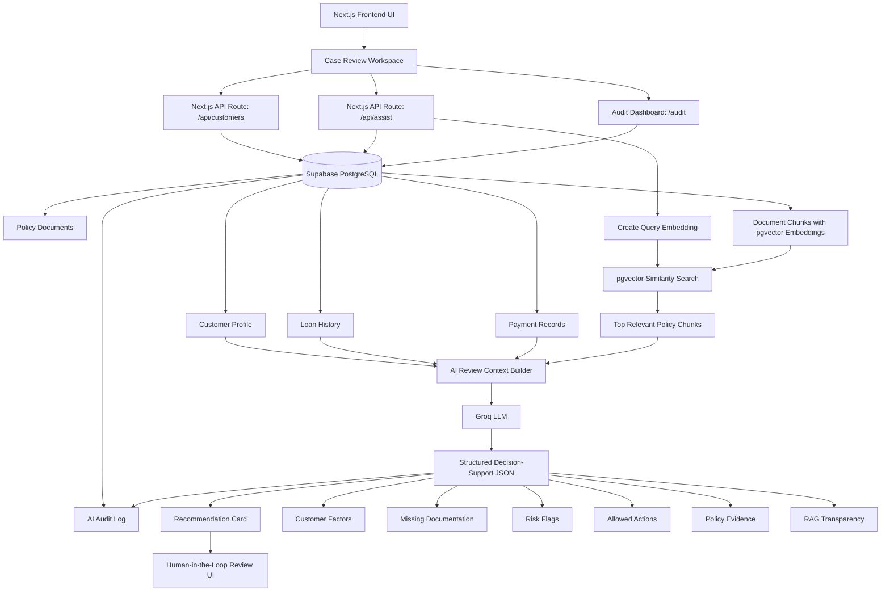
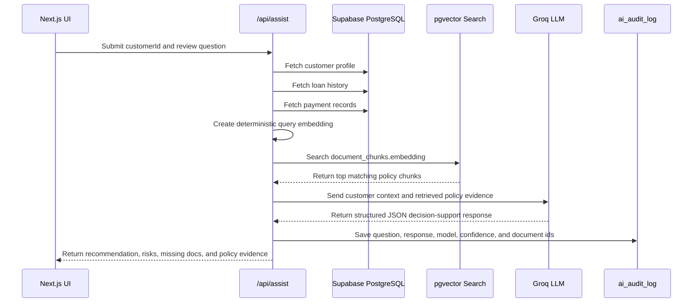
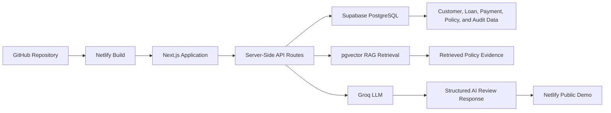
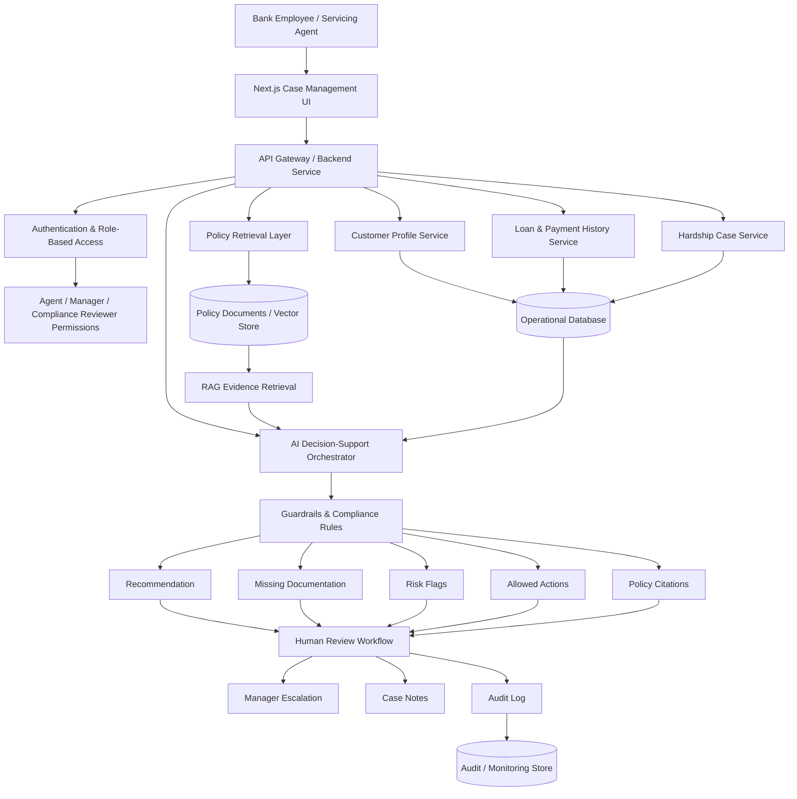

# AssistIQ Banking Copilot

**AssistIQ Banking Copilot** is an AI-powered customer assistance review workspace built to demonstrate AI architecture, enterprise software engineering, responsible AI design, retrieval-augmented generation, auditability, and human-in-the-loop decision support for regulated banking operations.

**Built by Jamshir Qureshi**

## Live Demo

[View AssistIQ Banking Copilot](https://assistiq-banking-copilot.netlify.app/)

## GitHub README

[View README and Architecture](https://github.com/llmaideveloper/assistiq-banking-copilot/blob/main/README.md)

---

## Project Overview

AssistIQ Banking Copilot simulates how a loan servicing or customer assistance team can use AI to review hardship assistance requests. The system helps servicing agents evaluate customer context, loan history, payment behavior, and policy evidence before routing the case for human review.

The application does **not** approve or deny customers. Instead, it provides structured AI decision support with:

- Customer and loan factors
- Payment history review
- pgvector-based policy evidence retrieval
- Groq LLM-generated structured review output
- Missing documentation
- Risk flags
- Allowed next actions
- Role-based workflow simulation
- Human-in-the-loop compliance guidance
- AI audit logging for traceability
- Audit dashboard for responsible AI monitoring

This project is designed as a portfolio demonstration of applied AI architecture, cloud-ready software engineering, responsible AI patterns, and enterprise-style system design in a regulated financial services workflow.

---

## Product Goal

AssistIQ is designed to help banking operations teams answer:

- Is the customer potentially eligible for hardship assistance review?
- What customer, loan, and payment factors should be considered?
- What policy evidence supports the recommendation?
- What documents are missing?
- What risk flags require escalation?
- What safe next actions can the servicing agent take?
- What role-based actions are available to an agent, manager, or compliance reviewer?
- How can AI assist without replacing authorized human decision-making?
- How can AI activity be logged for auditability and compliance review?

---

## Current Capabilities

The current deployed version supports:

- Customer case queue
- Supabase-backed customer, loan, and payment retrieval
- Supabase PostgreSQL `pgvector` policy retrieval
- Free-tier deterministic embeddings for policy chunks
- Groq LLM decision-support generation
- Structured JSON output contract
- RAG transparency panel
- Similarity score display for retrieved policy chunks
- Role-based workflow simulation
- Human-in-the-loop review controls
- AI audit log writing to Supabase
- Audit dashboard at `/audit`
- GitHub README link in the frontend footer
- Netlify cloud deployment

---

## Current Deployed Architecture

The deployed application uses a Next.js frontend with server-side API routes connected to Supabase PostgreSQL. Customer, loan, payment, and policy data are retrieved from Supabase. Policy chunks are searched through Supabase `pgvector`, then the retrieved evidence is sent with customer context to Groq LLM for structured decision-support output. Results are returned to the UI and saved to `ai_audit_log` for traceability.



---

## RAG Data Flow



---

## Deployment Flow



---

## AI Decision-Support Behavior

The AI assistant is intentionally constrained for regulated banking workflows.

It can:

- Summarize customer hardship context
- Review customer, loan, and payment factors
- Retrieve relevant policy evidence using pgvector
- Identify missing documentation
- Highlight risk flags
- Cite supporting policy evidence
- Recommend safe next actions
- Suggest escalation to a manager when needed
- Record review activity in an audit log

It cannot:

- Approve hardship assistance
- Deny hardship assistance
- Make a final credit decision
- Override policy
- Replace authorized human review

Every response includes a compliance disclaimer that the output is decision support only.

---

## Responsible AI Design

AssistIQ follows responsible AI principles for regulated workflows:

- **Human-in-the-loop:** Final decisions require authorized employee review.
- **Grounded responses:** The model receives retrieved policy evidence rather than relying only on general knowledge.
- **Policy evidence:** Recommendations include supporting policy references.
- **RAG transparency:** The UI displays retrieval mode, model used, and number of policy chunks retrieved.
- **Structured output:** LLM responses are constrained to a predictable JSON contract.
- **Audit logging:** AI questions, responses, confidence, model used, and retrieved documents are recorded.
- **Fallback behavior:** If vector retrieval or the LLM provider is unavailable, fallback logic prevents the application from failing.
- **Role-aware workflow:** The UI simulates servicing agent, manager, and compliance reviewer actions.
- **No autonomous approval:** The system never approves or denies assistance.

---

## Technology Stack

### Deployed Demo Stack

- **Next.js** – frontend and server-side API routes
- **React** – case review user interface
- **TypeScript** – typed application logic
- **Supabase PostgreSQL** – customer, loan, payment, policy, and audit data
- **Supabase pgvector** – semantic policy evidence retrieval
- **Deterministic embeddings** – free-tier embedding approach for demo use
- **Groq LLM** – dynamic AI decision-support generation
- **Netlify** – public cloud deployment
- **GitHub** – source control and deployment integration

### Supabase Tables Used

- `customers`
- `loans`
- `payments`
- `policy_documents`
- `document_chunks`
- `ai_audit_log`
- `user_roles`

---

## API Routes

### `/api/customers`

Retrieves customer case data from Supabase, including customer profile and related loan information for the case queue.

### `/api/assist`

Receives a customer ID and review question, then:

1. Fetches the customer profile from Supabase.
2. Fetches loan history.
3. Fetches payment records.
4. Creates a query embedding for the review question.
5. Searches `document_chunks` using Supabase `pgvector`.
6. Retrieves the most relevant policy evidence.
7. Builds a regulated AI review prompt.
8. Calls Groq LLM for structured decision-support output.
9. Saves the interaction to `ai_audit_log`.
10. Returns a structured response to the UI.

### `/api/rag/rebuild`

Admin-protected route that rebuilds deterministic embeddings for policy document chunks.

### `/api/audit`

Retrieves recent AI audit records from Supabase for the audit dashboard.

---

## Frontend Pages

### `/`

Main customer assistance review workspace.

Features:

- Case queue
- Customer profile summary
- AI review request
- Role selector
- AI recommendation
- RAG transparency panel
- Customer factors
- Missing documentation
- Risk flags
- Policy evidence with similarity scores
- Allowed actions by role
- Compliance notice
- GitHub README link

### `/audit`

Responsible AI audit dashboard.

Features:

- Recent review logs
- Customer ID
- Question
- Recommendation
- Model used
- Confidence
- Created timestamp
- Retrieved document count
- Data source
- Risk flags
- Missing documentation

---

## Environment Variables

The application requires these environment variables for local and Netlify deployment:

```env
NEXT_PUBLIC_SUPABASE_URL=your_supabase_project_url
SUPABASE_SERVICE_ROLE_KEY=your_supabase_service_role_key
GROQ_API_KEY=your_groq_api_key
RAG_ADMIN_TOKEN=your_private_admin_token
VECTOR_DIMENSIONS=384
NEXT_PUBLIC_GITHUB_REPO_URL=https://github.com/llmaideveloper/assistiq-banking-copilot/blob/main/README.md
```

Security notes:

- `SUPABASE_SERVICE_ROLE_KEY` must only be used server-side.
- `GROQ_API_KEY` must only be used server-side.
- `RAG_ADMIN_TOKEN` must only be used server-side or for private admin calls.
- `NEXT_PUBLIC_GITHUB_REPO_URL` is safe to expose because it is a public link.
- Do not commit `.env.local` to GitHub.
- Do not expose service keys in frontend code.

---

## Supabase pgvector Setup

Run the SQL script:

```text
sql/supabase-vector-rag.sql
```

This creates:

- `vector` extension
- `match_document_chunks` RPC function
- Optional vector index for document chunk retrieval

The system expects the `document_chunks.embedding` column to use 384 dimensions:

```env
VECTOR_DIMENSIONS=384
```

---

## Rebuilding RAG Embeddings

Run locally or against your deployed endpoint using your private admin token:

```bash
curl -X POST http://localhost:3000/api/rag/rebuild   -H "Content-Type: application/json"   -d '{"adminToken":"YOUR_RAG_ADMIN_TOKEN"}'
```

Expected response:

```json
{
  "status": "completed",
  "embeddingMode": "deterministic-free-tier",
  "vectorDimensions": 384,
  "chunksFound": 5,
  "chunksUpdated": 5,
  "failures": []
}
```

---

## Local Development

Install dependencies:

```bash
npm install
```

Run the development server:

```bash
npm run dev
```

Open:

```text
http://localhost:3000
```

Build locally:

```bash
npm run build
```

---

## Netlify Deployment

The app is deployed through Netlify using GitHub integration.

Recommended Netlify settings:

```text
Build command: npm run build
Publish directory: .next
```

Required Netlify environment variables:

```text
NEXT_PUBLIC_SUPABASE_URL
SUPABASE_SERVICE_ROLE_KEY
GROQ_API_KEY
RAG_ADMIN_TOKEN
VECTOR_DIMENSIONS
NEXT_PUBLIC_GITHUB_REPO_URL
```

Use:

```text
VECTOR_DIMENSIONS=384
```

because the Supabase embedding column is configured as `vector(384)`.

---

## Enterprise Reference Architecture

In a production banking environment, AssistIQ could be extended with a deeper enterprise architecture.



---

## AI Architecture Concepts Demonstrated

This project demonstrates:

- AI-assisted decision support for regulated financial workflows
- Retrieval-augmented generation using Supabase `pgvector`
- Server-side LLM integration with Groq
- Supabase-backed application data
- Policy evidence retrieval
- Structured LLM response contracts
- Human-in-the-loop workflow design
- Role-based workflow simulation
- Deterministic fallback behavior
- AI audit logging
- Audit dashboard for responsible AI traceability
- Secure environment variable handling
- Frontend/backend integration through Next.js API routes
- Cloud deployment through Netlify
- Responsible AI controls for high-risk decision workflows

---

## Portfolio Positioning

AssistIQ Banking Copilot demonstrates how AI can be integrated into enterprise operations while preserving compliance, traceability, explainability, and human accountability.

The project shows both hands-on implementation and architecture thinking across:

- Product workflow design
- AI orchestration
- Retrieval-augmented generation
- Vector database search
- Database integration
- API design
- Prompt design and guardrails
- Responsible AI
- Auditability
- Role-based workflow design
- Cloud deployment
- Software engineering delivery

**Built by Jamshir Qureshi**
